# Medical Platform

🇬🇧 [English](#english) · 🇺🇦 [Українська](#українська)

---

## English

A web platform for booking doctor appointments: registration verified against official registries (doctor license / patient insurance policy), appointment booking, medical records, and real-time chat between doctor and patient.

### Screenshots

<table>
<tr><td width="50%">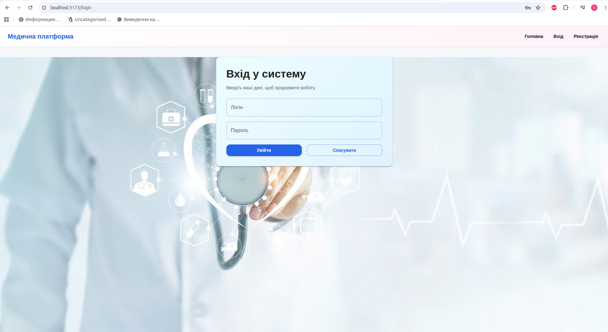<br><sub>Login</sub></td><td width="50%">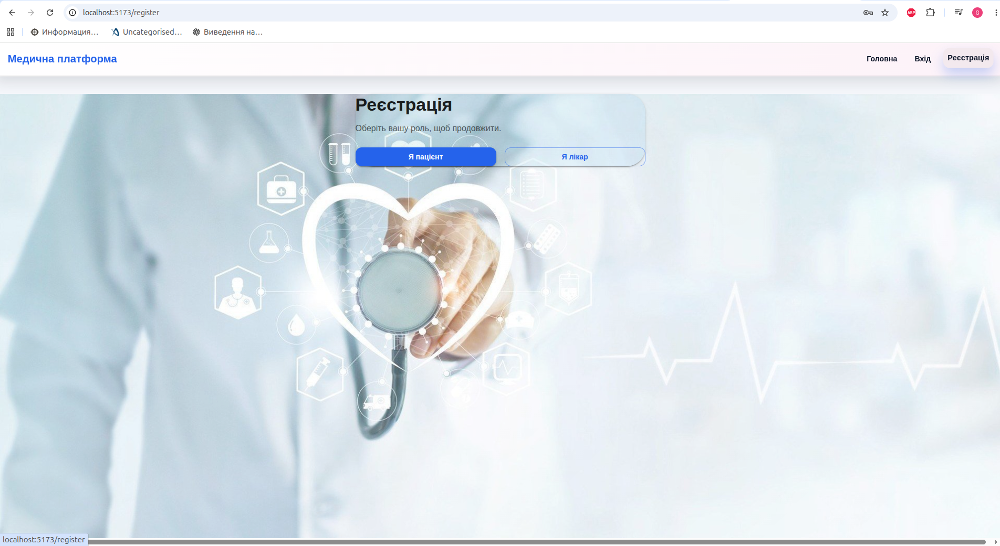<br><sub>Registration</sub></td></tr>
<tr><td width="50%">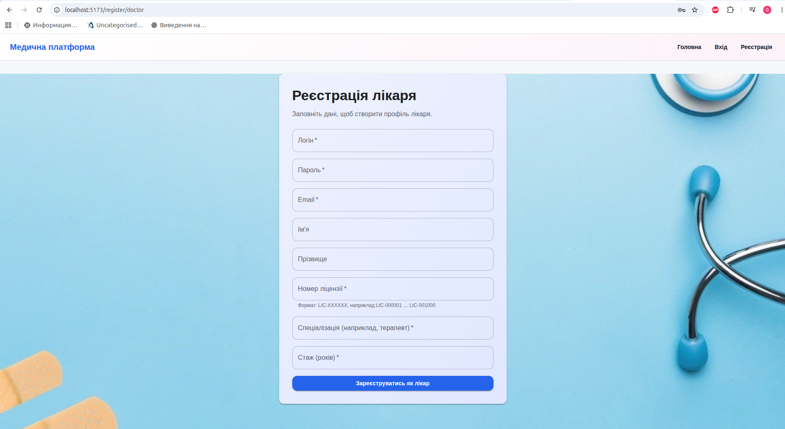<br><sub>Doctor registration</sub></td><td width="50%">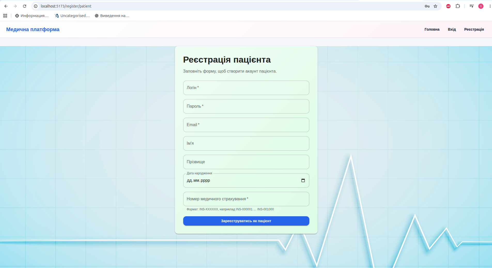<br><sub>Patient registration</sub></td></tr>
<tr><td width="50%">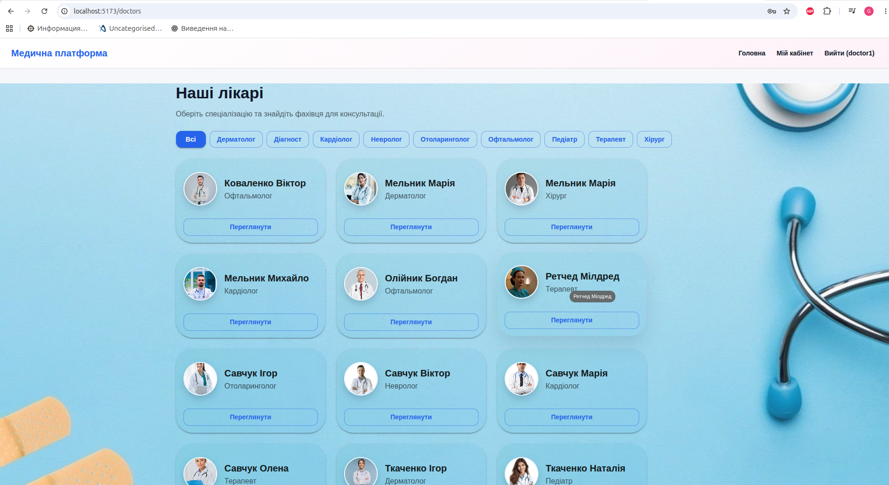<br><sub>Find a doctor</sub></td><td width="50%">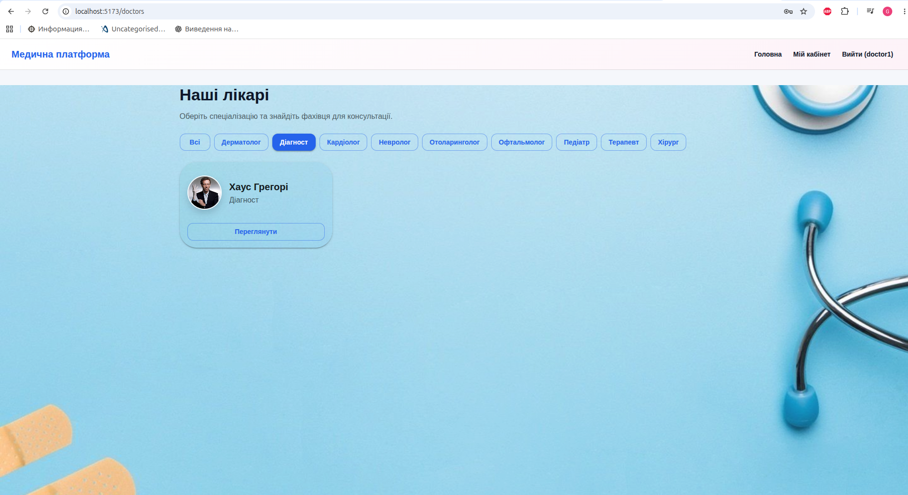<br><sub>Search with filters</sub></td></tr>
<tr><td width="50%">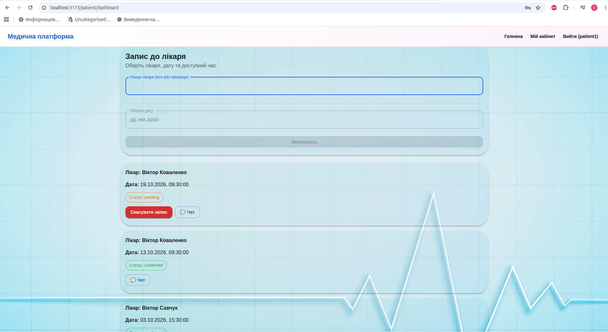<br><sub>Booking an appointment</sub></td><td width="50%">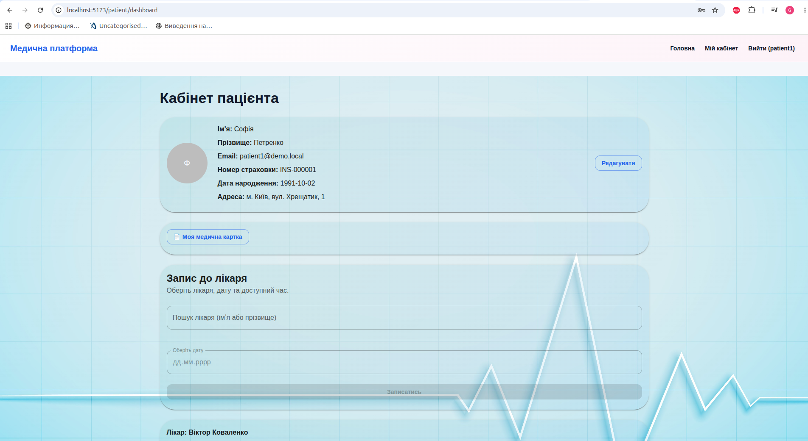<br><sub>Patient profile</sub></td></tr>
<tr><td width="50%">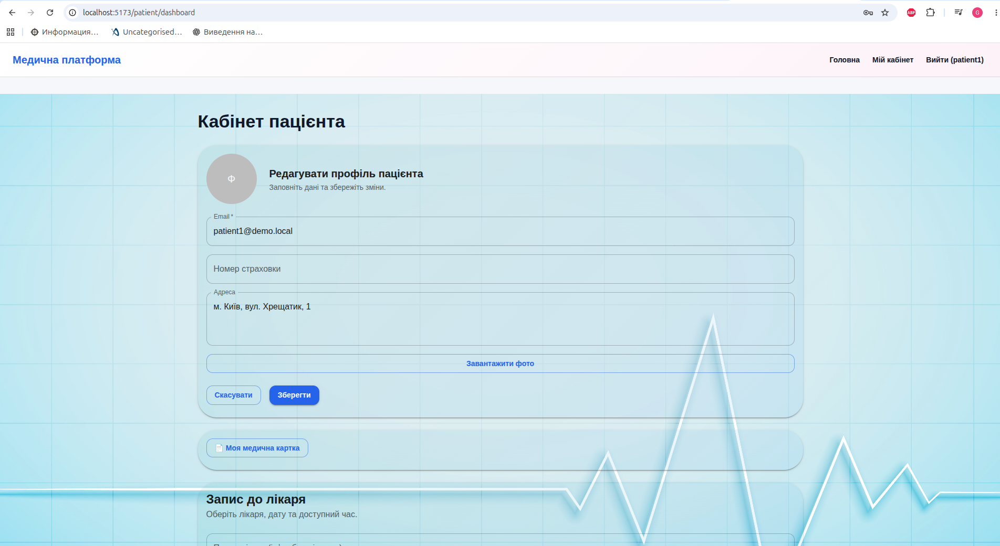<br><sub>Edit patient profile</sub></td><td width="50%">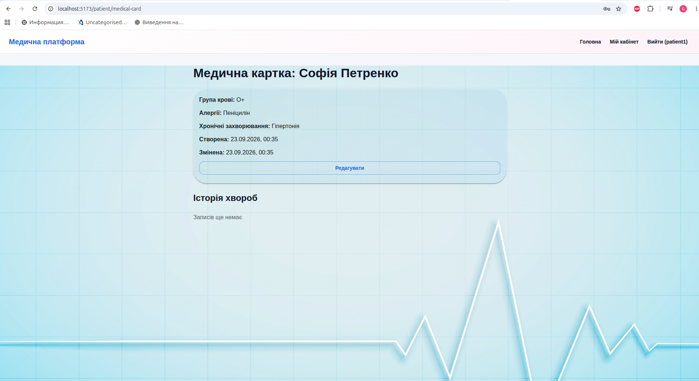<br><sub>Patient medical card</sub></td></tr>
<tr><td width="50%">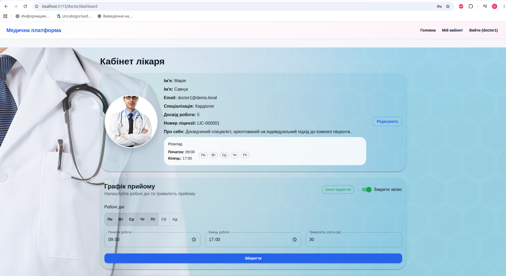<br><sub>Doctor profile</sub></td><td width="50%">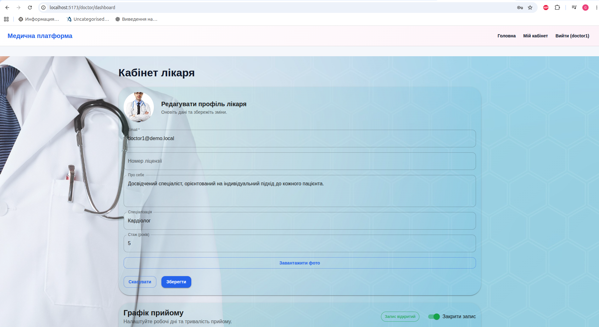<br><sub>Edit doctor profile</sub></td></tr>
<tr><td width="50%">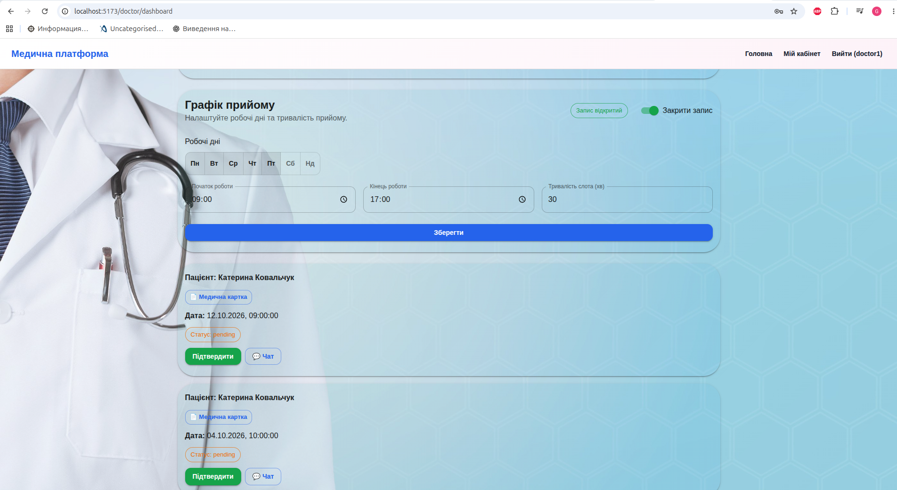<br><sub>Doctor's patients and chats</sub></td><td width="50%">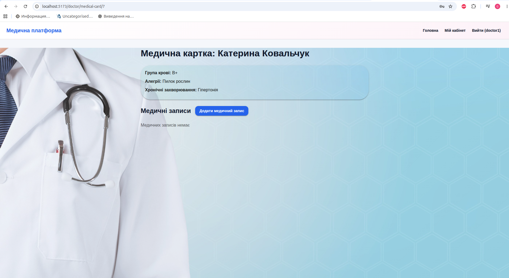<br><sub>Doctor view of a medical card</sub></td></tr>
<tr><td width="50%">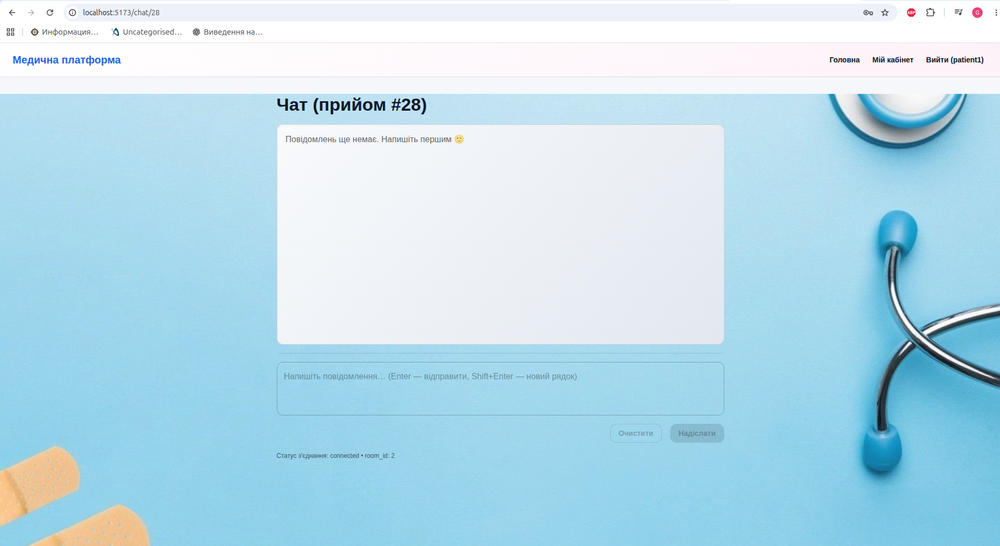<br><sub>Chat (patient side)</sub></td><td width="50%">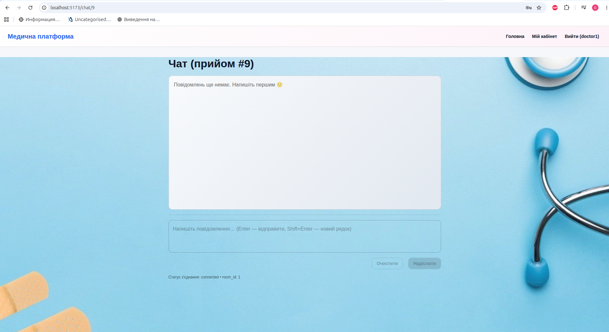<br><sub>Chat (doctor side)</sub></td></tr>
</table>

### Tech stack

**Backend:** Django 5 / Django REST Framework, JWT auth (SimpleJWT), Channels (WebSocket chat) on Redis, Celery, PostgreSQL, MinIO (S3-compatible file storage).

**Frontend:** React 19 + Vite, React Router, MUI (Material UI), Axios.

**Infrastructure:** Docker Compose, Nginx (reverse proxy + TLS + Basic Auth for the admin panel), Gunicorn/Uvicorn (ASGI).

### Project structure

```
backend/            Django project (API)
  accounts/          users, doctor/patient profiles, registration
  appointments/       appointment booking
  medical/            medical cards and records
  registry/           official registries of doctor licenses and insurance policies
  chat/                WebSocket chat doctor↔patient
frontend/            React SPA (Vite)
nginx/               nginx config, TLS certificate, .htpasswd for /admin/
docker-compose.yml   description of all services
.env                 environment variables for docker compose
```

### Prerequisites

- Docker + Docker Compose
- Node.js 20+ and npm (for the frontend in dev mode)

### Running the backend (Docker)

The backend, database, Redis, MinIO and Nginx are started via Docker Compose.

1. Create the external Docker volumes (once, if they don't exist yet):

   ```bash
   docker volume create medical_platform_postgres_data
   docker volume create medical_platform_static_data
   docker volume create medical_platform_minio_data
   ```

2. Check the `.env` file in the project root (adjust values if needed) — it defines `SECRET_KEY`, Postgres credentials, MinIO settings, etc.

3. Bring up all services:

   ```bash
   docker compose up -d --build
   ```

   On startup, the `web` container automatically applies Django migrations and collects static files (`entrypoint.sh`).

4. Verify everything is up:

   ```bash
   docker compose ps
   ```

   `web`, `project_db`, `redis`, `minio`, `minio_init`, `nginx` should all be `up`.

The backend is reachable **through Nginx**: `https://localhost/` (the certificate is self-signed — the browser will warn about it; accept the "Proceed to localhost" exception).

- API: `https://localhost/api/...`
- Django admin: `https://localhost/admin/` — in front of the Django login form there's also Basic Auth from nginx (`nginx/.htpasswd`)
- WebSocket chat: `wss://localhost/ws/...`
- MinIO (files): `https://localhost/minio/...`

The raw backend container (`web`, port 8000) is not exposed to the host — it's only reachable through nginx.

#### Creating a superuser

```bash
docker compose exec web python manage.py createsuperuser
```

#### Seeding demo data

For local development and screenshots there's a management command that creates the official license/insurance registries, demo doctors, demo patients, appointments and medical cards:

```bash
docker compose exec web python manage.py seed_demo
```

You can optionally set the amounts:

```bash
docker compose exec web python manage.py seed_demo --doctors 15 --patients 20 --registry-size 500
```

The command is idempotent — safe to re-run.

Demo accounts created:
- Doctors: `doctor1` … `doctorN`
- Patients: `patient1` … `patientN`
- Password for all demo accounts: `Demo12345!`

#### Doctor photos

Put the doctors' photos into `backend/media/doctor_photos/` **before** running `seed_demo`. File names decide the gender (and so the doctor's name):

- `male_1.jpg … male_8.jpg` — male doctors
- `female_1.jpg … female_7.jpg` — female doctors
- formats: `.jpg`, `.jpeg`, `.png`, `.webp`; square portrait (~512×512), up to 1 MB
- files without the `male_` / `female_` prefix are ignored; if no photos are found, doctors are created without a photo
- `male_8` → Dr. Gregory House, `female_7` → Mildred Ratched (see `SPECIAL_DOCTORS` in `seed_demo.py`)

<!-- Photos from the web (add your images/credits here): -->

#### Useful commands

```bash
docker compose logs -f web        # backend logs
docker compose exec web python manage.py <command>   # any Django command
docker compose down                # stop all services (volume data is preserved)
```

### Running the frontend (dev mode)

The frontend runs separately via the Vite dev server, which proxies `/api`, `/ws`, `/static` requests to nginx (`https://localhost`, see `frontend/vite.config.js`) — so the backend (step above) must be running.

```bash
cd frontend
npm install
npm run dev
```

Open `http://localhost:5173`.

#### Frontend production build

In production the frontend isn't run separately — it's built into static files and served by nginx itself (see `nginx/Dockerfile`, a multi-stage build `node:20-alpine` → `nginx:alpine`). This happens automatically during `docker compose up --build` (the `nginx` service).

### Typical first-run scenario

```bash
# 1. Create external volumes
docker volume create medical_platform_postgres_data
docker volume create medical_platform_static_data
docker volume create medical_platform_minio_data

# 2. Bring up the backend stack
docker compose up -d --build

# 3. Create an admin user
docker compose exec web python manage.py createsuperuser

# 4. Seed the database with demo data
docker compose exec web python manage.py seed_demo

# 5. Run the frontend
cd frontend && npm install && npm run dev
```

### Notes

- Registering as a doctor/patient on the site requires the given license number (`LIC-XXXXXX`) or insurance policy number (`INS-XXXXXX`) to already exist in the official registry (`registry` app) — that's why the demo data includes 1000 pre-created registry entries.
- MinIO images are pulled from `quay.io/minio/minio` and `quay.io/minio/mc` (the public images are no longer available on Docker Hub).

---

## Українська

Веб-платформа для запису пацієнтів до лікарів: реєстрація з перевіркою за офіційними реєстрами (ліцензія лікаря / страховий поліс пацієнта), запис на прийом, медичні картки, чат між лікарем і пацієнтом у реальному часі.

### Скриншоти

<table>
<tr><td width="50%"><br><sub>Вхід</sub></td><td width="50%"><br><sub>Реєстрація</sub></td></tr>
<tr><td width="50%"><br><sub>Реєстрація лікаря</sub></td><td width="50%"><br><sub>Реєстрація пацієнта</sub></td></tr>
<tr><td width="50%"><br><sub>Пошук лікаря</sub></td><td width="50%"><br><sub>Пошук з фільтрами</sub></td></tr>
<tr><td width="50%"><br><sub>Запис на прийом</sub></td><td width="50%"><br><sub>Профіль пацієнта</sub></td></tr>
<tr><td width="50%"><br><sub>Редагування профілю пацієнта</sub></td><td width="50%"><br><sub>Медична картка пацієнта</sub></td></tr>
<tr><td width="50%"><br><sub>Профіль лікаря</sub></td><td width="50%"><br><sub>Редагування профілю лікаря</sub></td></tr>
<tr><td width="50%"><br><sub>Пацієнти та чати лікаря</sub></td><td width="50%"><br><sub>Медична картка у лікаря</sub></td></tr>
<tr><td width="50%"><br><sub>Чат (пацієнт)</sub></td><td width="50%"><br><sub>Чат (лікар)</sub></td></tr>
</table>

### Стек технологій

**Backend:** Django 5 / Django REST Framework, JWT-авторизація (SimpleJWT), Channels (WebSocket-чат) на Redis, Celery, PostgreSQL, MinIO (S3-сумісне сховище файлів).

**Frontend:** React 19 + Vite, React Router, MUI (Material UI), Axios.

**Інфраструктура:** Docker Compose, Nginx (reverse proxy + TLS + Basic Auth для адмінки), Gunicorn/Uvicorn (ASGI).

### Структура проєкту

```
backend/            Django-проєкт (API)
  accounts/          користувачі, профілі лікарів/пацієнтів, реєстрація
  appointments/       записи на прийом
  medical/            медичні картки та записи
  registry/           офіційні реєстри ліцензій лікарів і страхових полісів
  chat/                WebSocket-чат лікар↔пацієнт
frontend/            React SPA (Vite)
nginx/               конфіг nginx, TLS-сертифікат, .htpasswd для /admin/
docker-compose.yml   опис усіх сервісів
.env                 змінні оточення для docker compose
```

### Передумови

- Docker + Docker Compose
- Node.js 20+ та npm (для фронтенда в dev-режимі)

### Запуск бекенду (Docker)

Backend, база даних, Redis, MinIO та Nginx піднімаються через Docker Compose.

1. Створити зовнішні Docker-volume (один раз, якщо їх ще немає):

   ```bash
   docker volume create medical_platform_postgres_data
   docker volume create medical_platform_static_data
   docker volume create medical_platform_minio_data
   ```

2. Перевірити `.env` у корені проєкту (за потреби скоригувати значення) — там задаються `SECRET_KEY`, дані Postgres, MinIO тощо.

3. Підняти всі сервіси:

   ```bash
   docker compose up -d --build
   ```

   При старті контейнера `web` автоматично застосовуються Django-міграції та збирається статика (`entrypoint.sh`).

4. Перевірити, що все піднялось:

   ```bash
   docker compose ps
   ```

   Мають бути `up`: `web`, `project_db`, `redis`, `minio`, `minio_init`, `nginx`.

Бекенд стає доступний **через Nginx**: `https://localhost/` (сертифікат самопідписаний — браузер попередить про це, потрібно підтвердити виняток "Перейти на localhost").

- API: `https://localhost/api/...`
- Django admin: `https://localhost/admin/` — перед формою логіну Django стоїть ще Basic Auth від nginx (`nginx/.htpasswd`)
- WebSocket-чат: `wss://localhost/ws/...`
- MinIO (файли): `https://localhost/minio/...`

Сирий бекенд-контейнер (`web`, порт 8000) назовні не проброшений — доступ лише через nginx.

#### Створення суперюзера

```bash
docker compose exec web python manage.py createsuperuser
```

#### Наповнення бази демоданими

Для локальної розробки та скріншотів є management-команда, яка створює офіційні реєстри ліцензій/страхових полісів, демо-лікарів, демо-пацієнтів, записи на прийом і медичні картки:

```bash
docker compose exec web python manage.py seed_demo
```

Опційно можна вказати кількість:

```bash
docker compose exec web python manage.py seed_demo --doctors 15 --patients 20 --registry-size 500
```

Команда ідемпотентна — її можна безпечно запускати повторно.

Створені демо-акаунти:
- Лікарі: `doctor1` … `doctorN`
- Пацієнти: `patient1` … `patientN`
- Пароль для всіх демо-акаунтів: `Demo12345!`

#### Фото лікарів

Покладіть фото лікарів у `backend/media/doctor_photos/` **до** запуску `seed_demo`. Стать (а отже й ім'я лікаря) визначається за назвою файлу:

- `male_1.jpg … male_8.jpg` — лікарі-чоловіки
- `female_1.jpg … female_7.jpg` — лікарки
- формати: `.jpg`, `.jpeg`, `.png`, `.webp`; квадратний портрет (~512×512), до 1 МБ
- файли без префікса `male_` / `female_` ігноруються; якщо фото немає — лікарі створюються без фото
- `male_8` → доктор Грегорі Хаус, `female_7` → Мілдред Ретчед (див. `SPECIAL_DOCTORS` у `seed_demo.py`)

<!-- Фото з інтернету (додайте сюди зображення/джерела): -->

#### Корисні команди

```bash
docker compose logs -f web        # логи бекенду
docker compose exec web python manage.py <команда>   # будь-яка Django-команда
docker compose down                # зупинити всі сервіси (дані у volume зберігаються)
```

### Запуск фронтенду (dev-режим)

Фронтенд запускається окремо через Vite dev server, який проксує запити `/api`, `/ws`, `/static` на nginx (`https://localhost`, див. `frontend/vite.config.js`) — тобто бекенд (крок вище) має бути піднятий.

```bash
cd frontend
npm install
npm run dev
```

Відкрити `http://localhost:5173`.

#### Продакшн-збірка фронтенду

У продакшн-режимі фронтенд не запускається окремо — він збирається у статичні файли й обслуговується самим nginx (див. `nginx/Dockerfile`, багатоступеневий білд `node:20-alpine` → `nginx:alpine`). Це відбувається автоматично під час `docker compose up --build` (сервіс `nginx`).

### Типовий сценарій першого запуску

```bash
# 1. Створити зовнішні volume
docker volume create medical_platform_postgres_data
docker volume create medical_platform_static_data
docker volume create medical_platform_minio_data

# 2. Підняти бекенд-стек
docker compose up -d --build

# 3. Створити адміністратора
docker compose exec web python manage.py createsuperuser

# 4. Наповнити базу демоданими
docker compose exec web python manage.py seed_demo

# 5. Запустити фронтенд
cd frontend && npm install && npm run dev
```

### Примітки

- Реєстрація лікаря/пацієнта на сайті вимагає, щоб вказаний номер ліцензії (`LIC-XXXXXX`) чи страхового поліса (`INS-XXXXXX`) вже існував в офіційному реєстрі (`registry` app) — саме тому демо-дані містять 1000 попередньо створених записів реєстру.
- Образи MinIO тягнуться з `quay.io/minio/minio` та `quay.io/minio/mc` (публічні образи на Docker Hub більше недоступні).
